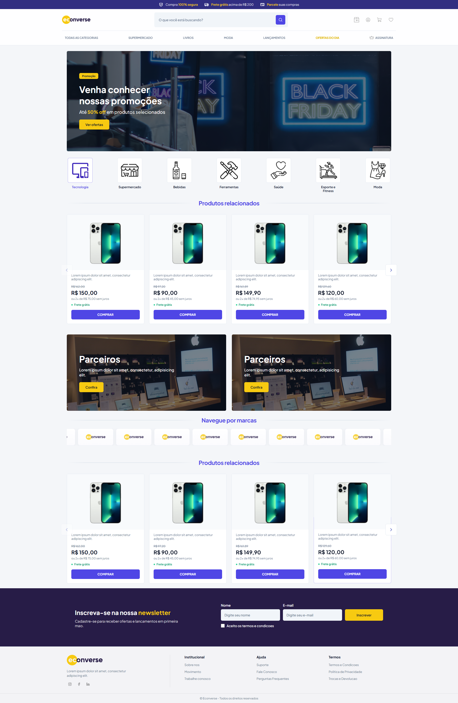

# Teste Front-End Econverse

Projeto desenvolvido em React + TypeScript com Vite.

## Preview do Projeto





## Como usar o projeto

### 1) Pré-requisitos

- [Node.js](https://nodejs.org/) (versão 18 ou superior)
- npm (já vem com o Node)

### 2) Instalação

```bash
npm install
```

### 3) Rodar em desenvolvimento

```bash
npm run dev
```

Após iniciar, acesse no navegador a URL exibida no terminal (normalmente `http://localhost:5173`).

### 4) Gerar build de produção

```bash
npm run build
```

### 5) Visualizar build localmente

```bash
npm run preview
```

## Tecnologias utilizadas

- React
- TypeScript
- Vite
- Sass (SCSS)
